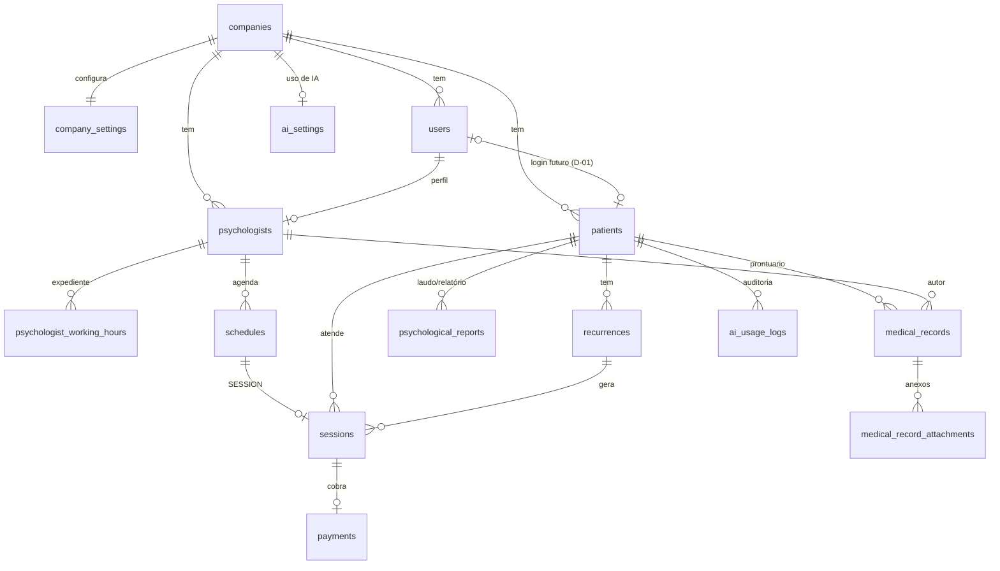

# 05 — Modelo de dados

Banco: **PostgreSQL 17** via EF Core 10 (`Common/Persistence/AppDbContext.cs`), nomes em **snake_case**.
Migration única: `InitialCreate` (o histórico antigo de 2025 foi descartado na reestruturação — `08`).
Configuração de cada tabela: `Features/<Módulo>/<Entidade>Configuration.cs`.

## Convenções

- **Ids:** `uuid` v7 (ordenável por tempo), gerados na aplicação.
- **Auditoria:** `created_at` / `updated_at` em `timestamptz` (UTC), preenchidos pelo `AuditingInterceptor`.
- **Exclusão lógica:** entidades de negócio têm `deleted_at`; um filtro global as esconde e `Remove()` vira UPDATE.
- **Empresa (tenant):** tabelas de negócio têm `company_id`; filtro global pela empresa do usuário logado.
- **Agenda:** `date` + `time` no horário **local da clínica** (fuso em `company_settings.time_zone`).
- **Enums** gravados como `int` (na API trafegam como texto).
- **Value objects** gravados como texto normalizado: CPF (11 dígitos), telefone (10–11 dígitos), CRP (`06/12345`), CEP (8 dígitos).

## Tabelas

### companies
| Coluna | Tipo | Obs |
|--------|------|-----|
| id | uuid PK | |
| name | varchar(150) NN | |
| created_at / updated_at | timestamptz | |

### company_settings (1:1 com companies, tipo owned)
| Coluna | Tipo | Obs |
|--------|------|-----|
| company_id | uuid PK/FK → companies (Cascade) | |
| session_duration_minutes | int NN default 50 | CHECK 15–240 (RN-32) |
| session_default_price | numeric(12,2) NULL | valor padrão (RN-51, uso na fase Financeiro) |
| time_zone | varchar(64) NN | IANA, padrão `America/Sao_Paulo` |

### users (ASP.NET Identity) + roles, user_roles, user_claims, user_logins, user_tokens, role_claims
| Coluna (além das do Identity) | Tipo | Obs |
|--------|------|-----|
| id | uuid PK | |
| full_name | varchar(150) NN | |
| company_id | uuid NN FK → companies (Restrict) | **sem filtro automático** (o login precisa achar o usuário); consultas filtram explicitamente |
| must_change_password | bool NN | senha temporária → troca obrigatória |
| lockout_end / access_failed_count | (Identity) | bloqueio após 5 tentativas por 15 min (RN-12) |
| created_at / updated_at | timestamptz | |

`roles`: dados essenciais via `HasData` (ids fixos): `Admin`, `Manager`, `Psychologist`, `Patient`.
`user_name` = e-mail (normalizado em minúsculas).

### psychologists
| Coluna | Tipo | Obs |
|--------|------|-----|
| id | uuid PK | |
| user_id | uuid NN FK → users (Restrict) | **único** entre não excluídos |
| company_id | uuid NN FK | tenant |
| license_number | varchar(9) NN | CRP `^\d{2}/\d{4,6}$` (D-03) |
| approach | int NN | `ApproachType` |
| phone | varchar(11) NULL | |
| deleted_at, created_at, updated_at | timestamptz | |

### psychologist_working_hours (coleção owned de psychologists)
| Coluna | Tipo | Obs |
|--------|------|-----|
| id | int PK | chave técnica |
| psychologist_id | uuid FK → psychologists (Cascade) | |
| day_of_week | int NN | `System.DayOfWeek` (0 = domingo) |
| start_time / end_time | time NN | faixas do mesmo dia não se sobrepõem (regra no domínio) |

### patients
| Coluna | Tipo | Obs |
|--------|------|-----|
| id | uuid PK | |
| company_id | uuid NN FK | tenant |
| full_name | varchar(150) NN | |
| cpf | char(11) NN | **único por empresa** entre não excluídos (RN-22); não editável (RN-27) |
| email | varchar(256) NN | minúsculas |
| phone | varchar(11) NN | |
| birth_date | date NULL | |
| status | int NN | `PatientStatus` (nasce `Active`, RN-25) |
| address_zip_code, address_street, address_number, address_complement, address_neighborhood, address_city, address_state | varchar/char | endereço opcional (tipo owned na mesma tabela) |
| notes | varchar(2000) NULL | observações gerais |
| user_id | uuid NULL FK → users | reservado para portal do paciente (D-01) |
| deleted_at, created_at, updated_at | timestamptz | |

### schedules (itens de agenda)
| Coluna | Tipo | Obs |
|--------|------|-----|
| id | uuid PK | |
| company_id | uuid NN FK | tenant |
| psychologist_id | uuid NN FK → psychologists (Restrict) | índice (psychologist_id, date) |
| date | date NN | local da clínica |
| start_time / end_time | time NN | CHECK `end_time > start_time` (RN-31); dia inteiro = 00:00–23:59 |
| type | int NN | `ScheduleType`: 0 Session, 1 Block |
| status | int NN | `ScheduleStatus`: 0 Pending, 1 Confirmed, 2 Cancelled (libera o horário) |
| block_reason | varchar(500) NULL | motivo do bloqueio |
| deleted_at, created_at, updated_at | timestamptz | |

### sessions (atendimentos)
| Coluna | Tipo | Obs |
|--------|------|-----|
| id | uuid PK | |
| company_id | uuid NN FK | tenant |
| schedule_id | uuid NN FK → schedules (Restrict), **único** | 1:1 (RN-36) |
| psychologist_id | uuid NN FK → psychologists | |
| patient_id | uuid NN FK → patients | índice (patient_id, status) |
| status | int NN | `SessionStatus`: 0 Scheduled, 1 Completed, 2 Cancelled, 3 NoShow (D-04) |
| notes | varchar(20000) NULL | Markdown (RN-46), sigiloso |
| feedback_score | int NULL | CHECK 0–10 (RN-45) |
| feedback_comment | varchar(1000) NULL | |
| cancellation_reason | varchar(500) NULL | RN-43 |
| reschedule_reason | varchar(500) NULL | último motivo de reagendamento (RN-42) |
| recurrence_id | uuid NULL FK → recurrences | sessão gerada por recorrência (RF010) |
| deleted_at, created_at, updated_at | timestamptz | |

### payments (RF011–RF014)
| Coluna | Tipo | Obs |
|--------|------|-----|
| id | uuid PK | |
| company_id | uuid NN FK | tenant |
| session_id | uuid NN FK → sessions | **único** entre os não excluídos: um pagamento por sessão; nasce Pendente com a sessão (D-08, RN-50) |
| amount | numeric(12,2) NN | CHECK ≥ 0; valor informado → recorrência → valor padrão da empresa (RN-51) |
| status | int NN | `PaymentStatus`: 0 Pending, 1 Paid, 2 Cancelled (RN-54) |
| method | int NULL | `PaymentMethod`: 0 CreditCard, 1 DebitCard, 2 Pix (RN-52) |
| paid_at | date NULL | não anterior a hoje (RN-53) |
| notes | varchar(500) NULL | |
| cancellation_reason | varchar(500) NULL | cancelamento ou estorno |
| deleted_at, created_at, updated_at | timestamptz | índice (company_id, status) |

### recurrences (RF010)
| Coluna | Tipo | Obs |
|--------|------|-----|
| id | uuid PK | |
| company_id, psychologist_id, patient_id | uuid NN FK | |
| type | int NN | `RecurrenceType`: 0 Weekly, 1 Monthly (dia da semana/do mês vêm de `start_date`) |
| start_date, end_date | date (end NULL) | |
| start_time, duration_minutes | time, int | |
| price | numeric(12,2) NN | CHECK ≥ 0; valor das sessões geradas |
| generated_until | date NN | sessões criadas até esta data (janela de 3 meses, D-05) |
| is_active | bool NN | encerrar cancela as sessões futuras agendadas |
| end_reason | varchar(500) NULL | |
| deleted_at, created_at, updated_at | timestamptz | |

### psychological_reports (RF016)
| Coluna | Tipo | Obs |
|--------|------|-----|
| id | uuid PK | |
| company_id, patient_id, psychologist_id | uuid NN FK | só o psicólogo autor acessa |
| template | int NN | `PsychologicalReportTemplate`: 0 PsychologicalReport (laudo), 1 PsychologicalStatement (relatório) — CFP 06/2019 |
| purpose, demand, procedure, analysis, conclusion | varchar(10000) NULL | seções do documento; todas obrigatórias para finalizar |
| include_session_summary | bool NN | inclui no PDF o resumo das sessões |
| status | int NN | 0 Draft, 1 Finalized (finalizado não é editado) |
| finalized_at | timestamptz NULL | |
| deleted_at, created_at, updated_at | timestamptz | |

### medical_records + medical_record_attachments (RF019, RF020)
| Coluna | Tipo | Obs |
|--------|------|-----|
| id | uuid PK | |
| company_id, patient_id, psychologist_id | uuid NN FK | índice (psychologist_id, patient_id); só o autor acessa (D-02) |
| title | varchar(200) NN | |
| content | varchar(50000) NN | Markdown |
| deleted_at, created_at, updated_at | timestamptz | exclusão lógica preserva a guarda do prontuário |

`medical_record_attachments`: `id`, `medical_record_id` (FK), `file_name varchar(200)`, `content_type varchar(100)`, `size_bytes bigint`,
auditoria/soft delete. O arquivo fica fora do banco, no `IFileStorage` (volume `Storage:Path`, D-06), na chave
`{company}/medical-records/{record}/{attachment}`.

### medical_record_access_logs (RD002, DT-24)
`id`, `company_id`, `medical_record_id` (FK), `user_id` (FK → users), `action int` (`MedicalRecordAccessAction`: 0 Viewed,
1 AttachmentDownloaded, 2 Denied), `attachment_id NULL`, `created_at`. Só inclusão; índice (medical_record_id, created_at).

### ai_settings (RF021, D-07)
| Coluna | Tipo | Obs |
|--------|------|-----|
| id | uuid PK | |
| company_id | uuid NN FK, **único** | uma configuração por clínica; sem registro = IA desabilitada |
| is_enabled | bool NN | |
| provider | int NN | `AiProvider`: 0 Claude, 1 OpenAi, 2 Gemini (chaves só no servidor) |
| share_session_notes, share_feedbacks, share_medical_records | bool NN | dados que podem ir para a IA (pseudonimizados) |
| consent_accepted_at | timestamptz NULL | aceite dos termos; limpo ao desabilitar |
| consent_accepted_by_user_id | uuid NULL FK → users | quem aceitou |
| created_at, updated_at | timestamptz | |

### ai_usage_logs (RF021 — auditoria LGPD)
`id`, `company_id`, `user_id`, `patient_id` (FKs), `kind int` (`AiSuggestionKind`: 0 SessionNotes, 1 PatientAnalysis, 2 NextSteps),
`provider int`, `model varchar(100)`, `prompt_characters int`, `created_at`. Uma linha por sugestão gerada; **não** guarda o prompt
nem a resposta. Índice (company_id, created_at).

### Removidas na reestruturação
`documents`, `document_fields` (FastReport), `config`, `config_ai` (chave/valor genérico, substituídos por `company_settings` e
`ai_settings`), `psychologists_hours` (virou `psychologist_working_hours`). `payments` foi redesenhada (acima).

## Relacionamentos

| Ligação | Cardinalidade | Ao excluir |
|---------|---------------|------------|
| companies → users, psychologists, patients, schedules, sessions | 1:N | Restrict |
| companies → company_settings | 1:1 | Cascade |
| users → psychologists | 1:0..1 | Restrict |
| users → patients (futuro portal) | 1:0..1 | Restrict |
| psychologists → psychologist_working_hours | 1:N | Cascade |
| psychologists → schedules, sessions | 1:N | Restrict |
| schedules → sessions | 1:0..1 | Restrict |
| patients → sessions | 1:N | Restrict |
| sessions → payments | 1:0..1 (um ativo) | Restrict |
| recurrences → sessions | 1:N | Restrict |
| psychologists, patients → recurrences, psychological_reports, medical_records | 1:N | Restrict |
| medical_records → medical_record_attachments, medical_record_access_logs | 1:N | Restrict |
| companies → ai_settings | 1:0..1 | Restrict |
| users, patients → ai_usage_logs | 1:N | Restrict |

Exclusões são lógicas: na prática nenhum registro de negócio é apagado fisicamente.

---

## Mudanças previstas
Notificações (RF024–RF026) ficaram para depois; não há tabela prevista ainda.
