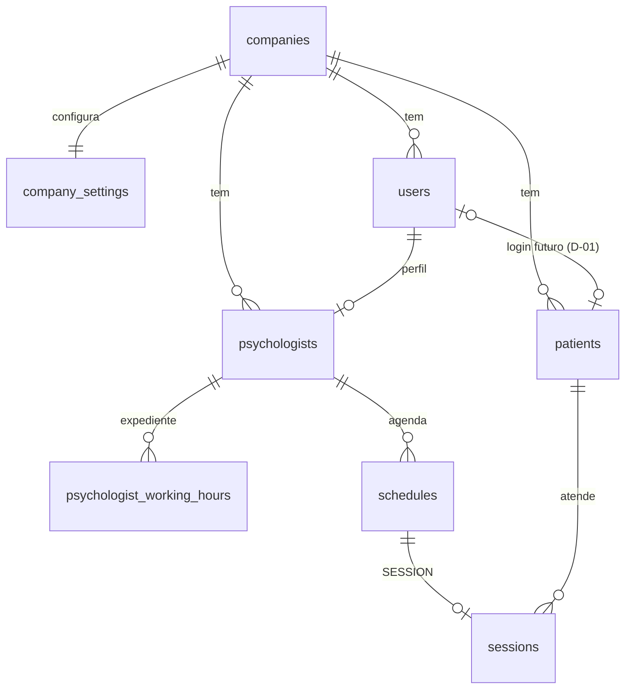

# 05 — Modelo de dados

Banco: **PostgreSQL 17** via EF Core 10 (`Common/Persistence/AppDbContext.cs`), nomes em **snake_case**.
Migration única: `InitialCreate` (o histórico antigo de 2025 foi descartado na reestruturação — `08`).
Configuração de cada tabela: `Features/<Módulo>/<Entidade>Configuration.cs`.

## Convenções

- **Ids:** `uuid` v7 (ordenável por tempo), gerados na aplicação.
- **Auditoria:** `created_at` / `updated_at` em `timestamptz` (UTC), preenchidos pelo `AuditingInterceptor`.
- **Exclusão lógica:** entidades de negócio têm `deleted_at`; um filtro global as esconde e `Remove()` vira UPDATE.
- **Empresa (tenant):** tabelas de negócio têm `company_id`; filtro global pela empresa do usuário logado.
- **Agenda:** `date` + `time` no horário **local da clínica** (fuso em `company_settings.time_zone`).
- **Enums** gravados como `int` (na API trafegam como texto).
- **Value objects** gravados como texto normalizado: CPF (11 dígitos), telefone (10–11 dígitos), CRP (`06/12345`), CEP (8 dígitos).

## Tabelas

### companies
| Coluna | Tipo | Obs |
|--------|------|-----|
| id | uuid PK | |
| name | varchar(150) NN | |
| created_at / updated_at | timestamptz | |

### company_settings (1:1 com companies, tipo owned)
| Coluna | Tipo | Obs |
|--------|------|-----|
| company_id | uuid PK/FK → companies (Cascade) | |
| session_duration_minutes | int NN default 50 | CHECK 15–240 (RN-32) |
| session_default_price | numeric(12,2) NULL | valor padrão (RN-51, uso na fase Financeiro) |
| time_zone | varchar(64) NN | IANA, padrão `America/Sao_Paulo` |

### users (ASP.NET Identity) + roles, user_roles, user_claims, user_logins, user_tokens, role_claims
| Coluna (além das do Identity) | Tipo | Obs |
|--------|------|-----|
| id | uuid PK | |
| full_name | varchar(150) NN | |
| company_id | uuid NN FK → companies (Restrict) | **sem filtro automático** (o login precisa achar o usuário); consultas filtram explicitamente |
| must_change_password | bool NN | senha temporária → troca obrigatória |
| lockout_end / access_failed_count | (Identity) | bloqueio após 5 tentativas por 15 min (RN-12) |
| created_at / updated_at | timestamptz | |

`roles`: dados essenciais via `HasData` (ids fixos): `Admin`, `Manager`, `Psychologist`, `Patient`.
`user_name` = e-mail (normalizado em minúsculas).

### psychologists
| Coluna | Tipo | Obs |
|--------|------|-----|
| id | uuid PK | |
| user_id | uuid NN FK → users (Restrict) | **único** entre não excluídos |
| company_id | uuid NN FK | tenant |
| license_number | varchar(9) NN | CRP `^\d{2}/\d{4,6}$` (D-03) |
| approach | int NN | `ApproachType` |
| phone | varchar(11) NULL | |
| deleted_at, created_at, updated_at | timestamptz | |

### psychologist_working_hours (coleção owned de psychologists)
| Coluna | Tipo | Obs |
|--------|------|-----|
| id | int PK | chave técnica |
| psychologist_id | uuid FK → psychologists (Cascade) | |
| day_of_week | int NN | `System.DayOfWeek` (0 = domingo) |
| start_time / end_time | time NN | faixas do mesmo dia não se sobrepõem (regra no domínio) |

### patients
| Coluna | Tipo | Obs |
|--------|------|-----|
| id | uuid PK | |
| company_id | uuid NN FK | tenant |
| full_name | varchar(150) NN | |
| cpf | char(11) NN | **único por empresa** entre não excluídos (RN-22); não editável (RN-27) |
| email | varchar(256) NN | minúsculas |
| phone | varchar(11) NN | |
| birth_date | date NULL | |
| status | int NN | `PatientStatus` (nasce `Active`, RN-25) |
| address_zip_code, address_street, address_number, address_complement, address_neighborhood, address_city, address_state | varchar/char | endereço opcional (tipo owned na mesma tabela) |
| notes | varchar(2000) NULL | observações gerais |
| user_id | uuid NULL FK → users | reservado para portal do paciente (D-01) |
| deleted_at, created_at, updated_at | timestamptz | |

### schedules (itens de agenda)
| Coluna | Tipo | Obs |
|--------|------|-----|
| id | uuid PK | |
| company_id | uuid NN FK | tenant |
| psychologist_id | uuid NN FK → psychologists (Restrict) | índice (psychologist_id, date) |
| date | date NN | local da clínica |
| start_time / end_time | time NN | CHECK `end_time > start_time` (RN-31); dia inteiro = 00:00–23:59 |
| type | int NN | `ScheduleType`: 0 Session, 1 Block |
| status | int NN | `ScheduleStatus`: 0 Pending, 1 Confirmed, 2 Cancelled (libera o horário) |
| block_reason | varchar(500) NULL | motivo do bloqueio |
| deleted_at, created_at, updated_at | timestamptz | |

### sessions (atendimentos)
| Coluna | Tipo | Obs |
|--------|------|-----|
| id | uuid PK | |
| company_id | uuid NN FK | tenant |
| schedule_id | uuid NN FK → schedules (Restrict), **único** | 1:1 (RN-36) |
| psychologist_id | uuid NN FK → psychologists | |
| patient_id | uuid NN FK → patients | índice (patient_id, status) |
| status | int NN | `SessionStatus`: 0 Scheduled, 1 Completed, 2 Cancelled, 3 NoShow (D-04) |
| notes | varchar(20000) NULL | Markdown (RN-46), sigiloso |
| feedback_score | int NULL | CHECK 0–10 (RN-45) |
| feedback_comment | varchar(1000) NULL | |
| cancellation_reason | varchar(500) NULL | RN-43 |
| reschedule_reason | varchar(500) NULL | último motivo de reagendamento (RN-42) |
| deleted_at, created_at, updated_at | timestamptz | |

### Removidas na reestruturação
`documents`, `document_fields` (FastReport), `config`, `config_ai` (chave/valor genérico, substituído por `company_settings`),
`payments` (volta redesenhada na fase Financeiro), `psychologists_hours` (virou `psychologist_working_hours`).

## Relacionamentos

| Ligação | Cardinalidade | Ao excluir |
|---------|---------------|------------|
| companies → users, psychologists, patients, schedules, sessions | 1:N | Restrict |
| companies → company_settings | 1:1 | Cascade |
| users → psychologists | 1:0..1 | Restrict |
| users → patients (futuro portal) | 1:0..1 | Restrict |
| psychologists → psychologist_working_hours | 1:N | Cascade |
| psychologists → schedules, sessions | 1:N | Restrict |
| schedules → sessions | 1:0..1 | Restrict |
| patients → sessions | 1:N | Restrict |

Exclusões são lógicas: na prática nenhum registro de negócio é apagado fisicamente.

---

## Mudanças previstas (fases seguintes)

### M-05 · payments (RF011–RF014)
`id`, `company_id`, `session_id` (FK, um pagamento ativo por sessão), `amount numeric(12,2)`, `status int` (`PaymentStatus { Pending, Paid, Cancelled }`),
`method int NULL` (`PaymentMethod { CreditCard, DebitCard, Pix }`), `paid_at date NULL`, `notes`, auditoria/soft delete.
Depende de D-08 (pagamento nasce pendente com a sessão?).

### M-06 · recurrences (RF010)
`id`, `company_id`, `psychologist_id`, `patient_id`, `type int` (`Weekly`, `Monthly`), `day_of_week NULL`, `day_of_month NULL`,
`start_time`, `duration_minutes`, `session_price`, `start_date`, `end_date NULL`, `is_active`; `sessions.recurrence_id NULL`. Depende de D-05.

### M-07 · medical_records + medical_record_attachments (RF019, RF020)
Prontuário por paciente e psicólogo, com anexos (arquivo fora do banco — D-06).

### M-08 · psychological_reports (RF016)
Laudo: paciente, psicólogo, motivo, conteúdo; PDF gerado sob demanda (QuestPDF).

### M-09 · IA (RF021)
Tabela própria de consentimento/configuração (`ai_settings`: habilitado, tipos de dado liberados, provedor) — D-07.
